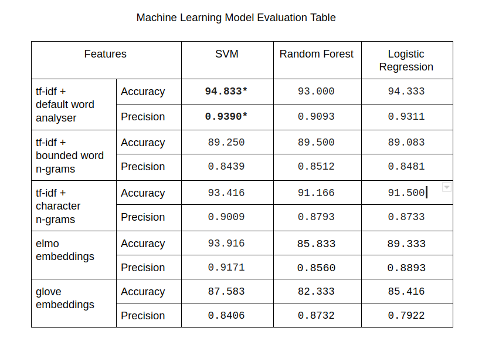

# BODY-SHAMING CLASSIFIER

Body shaming is an act in which individuals are judged negatively based on their physical appearance.
- Statistics show that nearly 94% of teen girls and 65% of teen boys have been body shamed

## _Aim of this project_ : Study and Identify Bodyshaming in Social Media Posts
- Body shaming classifier classifies the input text, mainly Instagram based (both text and hashtags) as body shaming or not, which can be integrated into the framework to weed out toxicity. 

### _Project Results_
- The models were trained on the data that was manually annotated by the team members. 
- We evaluate three machine learning models, *Support Vector Machine (SVM)*, *Random Forest*, and *Logistic Regression (LR)* and also three deep learning models, a vanilla *deep neural net (DNN)*, *Convolutional Neural Network (CNN)*, *Bi-directional Long Short Term Memory (Bi-LSTM)* on their accuracy and precision. 
- We have also incorporated pseudo-labelling into the framework to improve the model accuracy by extra data addition. 
- Their performance was evaluated on the gold standard data provided.

### Data Format
The dataset consists of text, collected mainly from Instagram posts. The posts were collected by crawling Instagram using relevant hashtags (for example, #fatshaming, #skinnyshaming, #bodyshaming).

*Manually annotated data using certain guidelines* : 
1. Objectionable comments/behaviour concerning looks including hair.
2. Comments about shaving or having body hair also come under this category. 
3. Promotion of certain body types/standards also comes under this category of sexism.
4. Examples of sexist misconceptions or wrongdoings falling in this category:
    “She is fat/ugly/dark.”
    “Who will be interested in her?!”
    “It’s a false rape allegation; why would someone want to rape such an ugly bitch?”
    “Have you seen yourself in the mirror?”

### Model Results
[]
(./ml_results.png)

### Link to project demo
http://www.example.com
